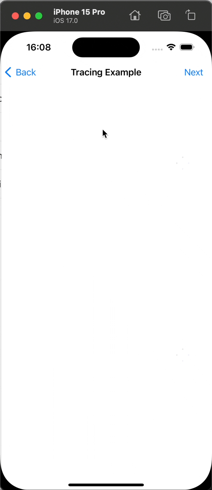
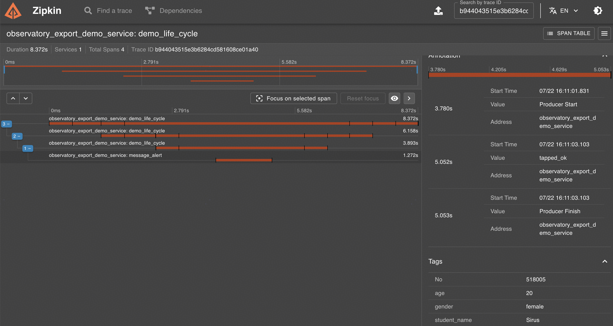
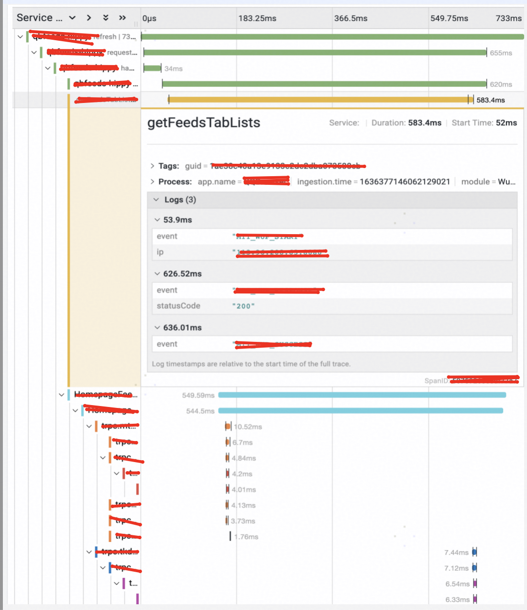
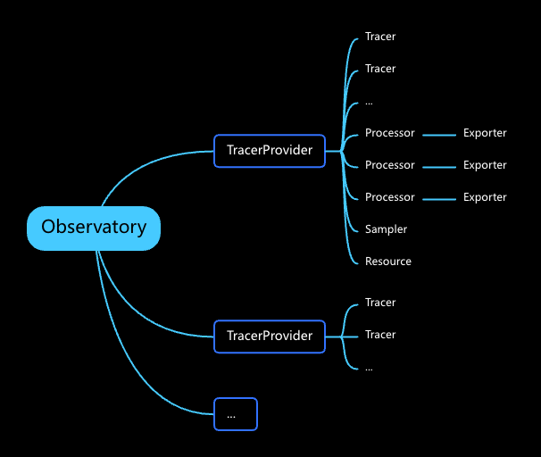
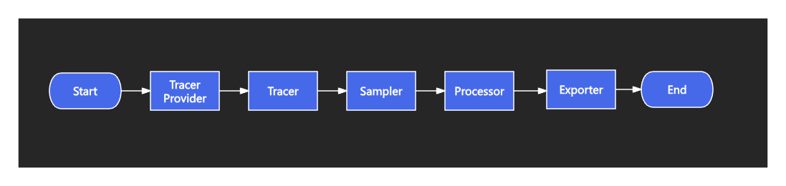

# Observatory


A swift written distributed tracing and log clinet built conformimg to **OpenTelemetry**'s specifications

*For details of opentelemetry, go to [here](https://opentelemetry.io/docs/what-is-opentelemetry/)*

## What it does?

### DemoScenario

​	Here's an example of user activity. In this show case, the user has done following actions:

* Enter trace page
* Segue to another page
* Press a button and segue to another page
* view a table list, select one of the item
* An alert is shown, the user tapped OK



### Data Browse

Here's the distributed tracing data collected in an Zipkin backend, by searching the trace ID the developer can look into details when the App is used by the user. Including:

*  Each span duration
* Attribute added to the span
* Event happend during the span period



### summary

​	In short, To help application developer to improve the observability of their apps. By offering distributed tacing data to the backend colletor, developer can see through the connection between logs and understand the hole process they defined rather than searching in tons of god knows wether they are relative logs and die trying to organize the whole situation.

​	when the distributed tracing data sent to backend, in a Grafana backend would looks like this:



You can monitor each span you defined and created, how they relate to one and other, what futher information they carry.

## Features

* Pure Swift coding
* MacOS/iOS support
* iOS 10+ compatible
* Logging & Distributed Tracing functions available
* Defualt **Zipkin** support
* Cocoapods & SPM intergration support

* And more!

## Installation

### Cocoapods

Observatory is available through [CocoaPods](https://cocoapods.org). To install
it, simply add the following line to your Podfile:

```ruby
pod 'ObservatoryPod'
```

Alternatively, you can intergrate the module only if it's what you need:

````shell
pod 'Observatory/Tracing'
````

For default **Zipkin** implementation:

````shell
pod 'Observatory/TracingZipkin'
````

### SPM

Add your GitHub account and install Package from xcode

Like Cocoapods, SPM offers 4 moudles for developer to import

`ObservatoryCommon`, `ObservatoryLogging`, `ObservatoryTracing`, `ZipkinExport`

## Usage

### Cocoapod Demo

1. For cocoapods intergration and example, **clone** this repository and navigate to `Example/SFRoleDriverModels.xcworkspace`
2. Use the commandline and run command `pod install` (Assuming you already installed Cocoapods)
3. Run the `SFRoleDriverModels.xcworkspace` with **XCode**

### SPM Demo

1. For SPM intergration and example, **clone** this repository and navigate to `ObservatorySPMExample/ObservatorySPMExample.xcodeproj`
2. Simplly Run the project with **Xcode**

### Component Structure

The Components within the SDK are layouted like this:



* **TracerProvider**: To create and manage tracers, manage a `Processors` queue and a `Sampler`, holds the recouce instantance for commonly used data, for most case a shared singleton would be enough. 
* **Tracer**: Created by the `tracerProvider`,  serves as a `span` creator.
* **Sampler**: When a `span` is created by the `tracer`, it should passed to the `sampler` and decide if it should be record and export.
* **Processor**:  Created by User and passed to `TracerPrvider` during its creatation, an interceptor for span life cycle, during `span`'s start and end it can perform additional action for the `span`. It will effet one by one according to the queue holded by the `tracerprovider`.
* **Exporter**:   Created by User and passed to `Processor` during its creatation, each processor can only bind with one exporter. It handles the span data's exportation to the remote end distributed tracing data collector via APIs.
* **Resource**:  Created by User and passed to `TracerPrvider` during its creatation, the commonly used data send alongside the span data to the  remote end distributed tracing data collector.

### Distributed Tracing Data (Spans) data flow



1. TracerProvider is created and configured. It must hold by an instance during App lifetime incase it's recycle and deinit by system.
2. Tracer, created by tracerprovider, usually one would be enough
3. When tracer creates a span, it should passed to the sampler first, sampler can be defined by user and decide if this span is valid and wether it can be used.
4. All the processor will call thier onStart and onEnd method during span's lifetime.
5. After the span is ended, it will passed to the exporter to export.

## Author

RavenDeng dlfkid@icloud.com

## License

Observatory is available under the MIT license. See the [LICENSE](LICENSE) file for more info.
